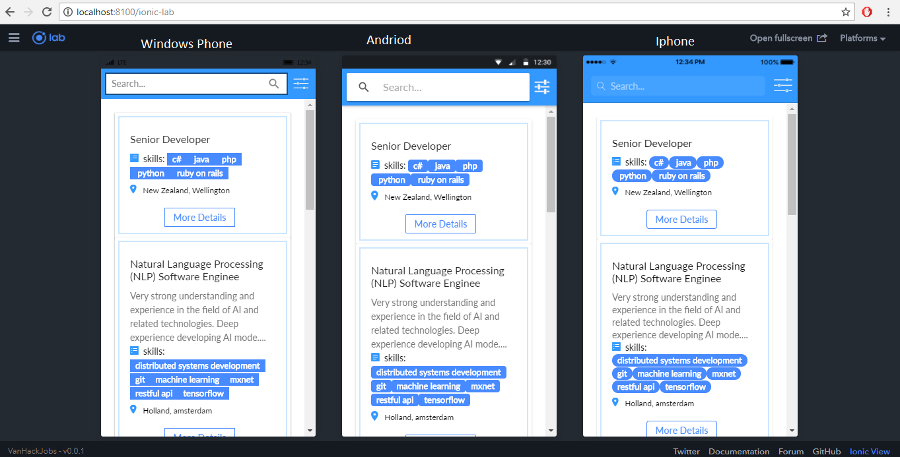

# Hybrid-Ionic-Mobile-App-VanHack-Project

# Crossplatorm Mobile Application 

* This project is:
* An app to show Job posts and Job details;
* Filters;
* Infinite scroll;
* Multiple device's form factors;

## Getting Started

* [Download the installer](https://nodejs.org/) for Node.js 6 or greater.
* Install the ionic CLI globally: `npm install -g ionic`
* Clone this repository: `https://github.com/paulappz/Hybrid-Ionic-Mobile-App-VanHack-Project.git`.
* Run `npm install` from the project root.
* Run `ionic serve` in a terminal from the project root.


## App Preview


All app preview screenshots were taken by running `ionic serve --lab` on a windows 10  /chrome browser.

- [HomePage Page]

  
  
- [JobDetails  Page]

  

- [JobFilter  Page]

  


## Deploying

* PWA - Un-comment [this](https://github.com/ionic-team/ionic2-app-base/blob/master/src/index.html#L21), run `npm run ionic:build --prod` and then push the `www` folder to your favorite hosting service
* Android - Run `ionic cordova run android --prod`
  - If you are deploying to Android 4.4 or below we recommend adding crosswalk: `cordova plugin add cordova-plugin-crosswalk-webview`
* iOS - Run `ionic cordova run ios --prod`

## File Structure of App

```
ionic-conference-app/
├-- .github/                            * GitHub files
│   ├── CONTRIBUTING.md                 * Documentation on contributing to this repo
│   └── ISSUE_TEMPLATE.md               * Template used to populate issues in this repo
|
|-- resources/
|
|-- src/
|    |-- app/
|    |    ├── app.component.ts
|    |    └── app.module.ts
|    |    └── app.template.html
|    |    └── main.ts
|    |
|    |-- assets/
|    |    ├── data/
|    |    |    └── jobs.json
|    |    |
|    |    ├── fonts/
|    |    |     ├── ionicons.eot
|    |    |     └── ionicons.svg
|    |    |     └── ionicons.ttf
|    |    |     └── ionicons.woff
|    |    |     └── ionicons.woff2
|    |    |
|    |    ├── img/
|    |
|    |-- pages/                          * Contains all of our pages
│    │    │
│    │    │── home/                      * Home page
│    │    │    ├── home.html             * HomePage template
│    │    │    └── home.ts               * HomePage code
│    │    │    └── home.scss             * HomePage stylesheet
│    │    │
│    │    │── detailspops/               * Detailspops tab page
│    │    │    ├── detailspops.html      * DetailspopsPage template
│    │    │    └── detailspops.module.ts * DetailspopsPageModule code
│    │    │    └── detailspops.ts        * DetailspopsPage code
│    │    │    └── detailspops.scss      * DetailspopsPage stylesheet
│    │    │

|    |    |
│    │    │── job-filter/                * JobFilterPage 
│    │    │    ├── job-filter.html       * JobFilterPage template
│    │    │    └── job-filter.module.ts  * JobFilterPageModule code
│    │    │    └── job-filter.ts         * JobFilterPage code
│    │    │    └── job-filter.scss       * JobFilterPage stylesheet
│    │    │
│    │    └── Introduction/              * Vanhack Intro page
│    │         ├── intro.html            * IntroPage template
│    │         └── intro.module.ts       * IntroPageModule code
│    │         └── intro.ts              * IntroPage code
│    │         └── intro.scss            * IntroPage stylesheet
|    |
│    ├── providers/                      * Contains all Injectables
│    │     └── job.ts                    * Job Listings Data code
│    ├── theme/                          * App theme files
|    |     ├── variables.scss            * App Shared Sass Variables
|    |
|    |-- index.html
|
|-- www/
|    ├── assets/
|    |    ├── data/
|    |    |    └── data.json
|    |    |
|    |    ├── fonts/
|    |    |     ├── ionicons.eot
|    |    |     └── ionicons.svg
|    |    |     └── ionicons.ttf
|    |    |     └── ionicons.woff
|    |    |     └── ionicons.woff2
|    |    |
|    |    ├── img/
|    |
|    └── build/
|    └── index.html
|
├── .editorconfig                       * Defines coding styles between editors
├── .gitignore                          * Example git ignore file
├── LICENSE                             * Apache License
├── README.md                           * This file
├── config.xml                          * Cordova configuration file
├── ionic.config.json                   * Ionic configuration file
├── package.json                        * Defines our JavaScript dependencies
├── tsconfig.json                       * Defines the root files and the compiler options
├── tslint.json                         * Defines the rules for the TypeScript linter
